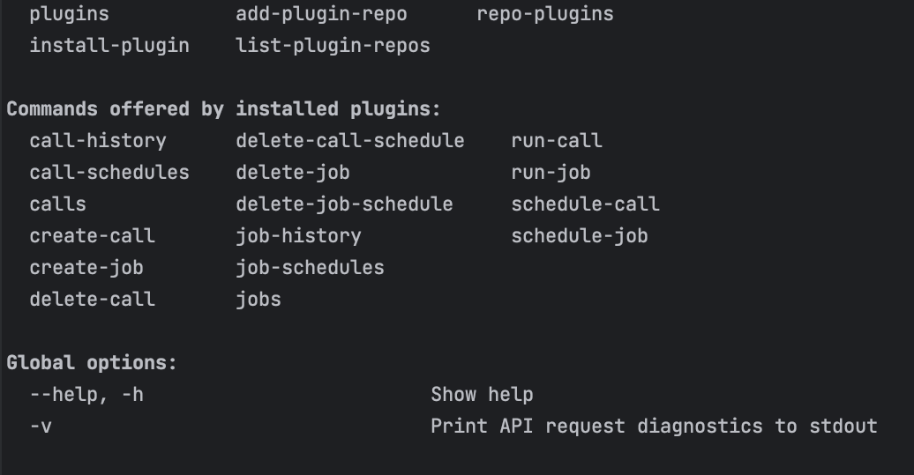

# tas-scheduler-node-typescript-demo

## Prerequisites

Using the Tanzu Scheduler capabilities via the CF CLI requires the installation of the scheduler plugin extension.
The scheduler plugin can be downloaded from the Broadcom Product downloads page found [here](https://support.broadcom.com/group/ecx/productdownloads?subfamily=Scheduler).

**Add PCF Scheduler service**

Before deploying the app, an instance of the **scheduler-for-pcf** service has to be created and available within the environment. An instance of the service can
be created via the CLI using the following command:

```
cf create-service scheduler-for-pcf standard pcf-scheduler
```

The service if created successfully can be verified

Via CLI using the following command:

```
cf services
```

or via the TAS App Manager console:


## Creating the job

To create a job associated with the deployed application, use the following command:

```
cf create-job tas-scheduler-node-typescript-demo display-date-job "chmod +x ./dist/index.js && node ./dist/index.js"
```
where:

_tas-scheduler-node-typescript-demo_ is the name of the application installed in TAS
_display-date-job_ is the job name

In this particular example,  we want to create a job which will run command **chmod +x ./dist/index.js && node ./dist/index.js** when triggered.

## Scheduling the job

To schedule to job to run on a Cron schedule execute a command similar to that below:

```
cf schedule-job display-date-job "0/10 * ? * *"
```

For additional commands related to scheduling a job please use the following command:

```
cf --help
```

Commands available with the install of the Schedule plugin should be visible under the **Commands offered by installed plugins** section:




## Additional References

[Using a cf CLI plug-in](https://docs.cloudfoundry.org/cf-cli/use-cli-plugins.html)